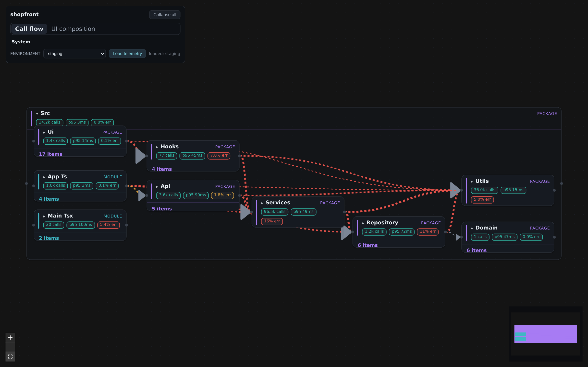
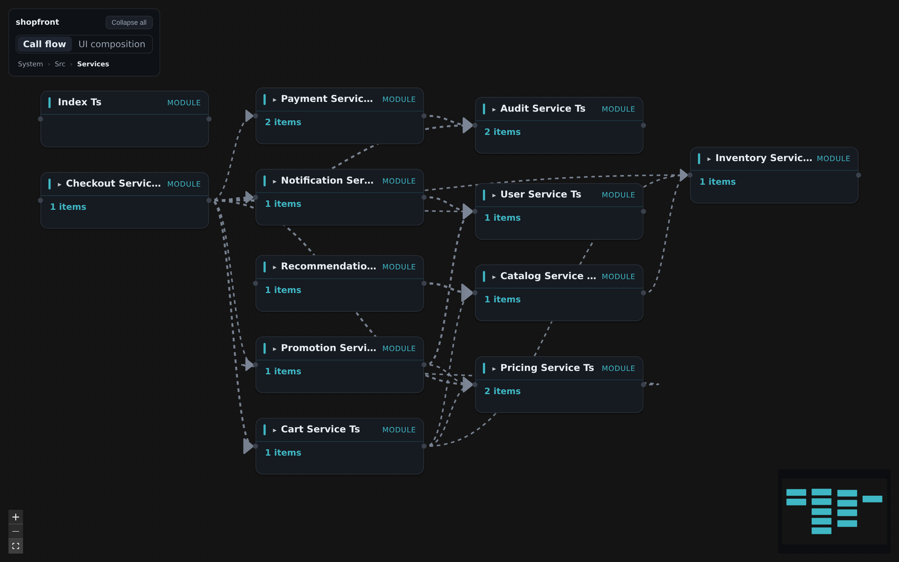
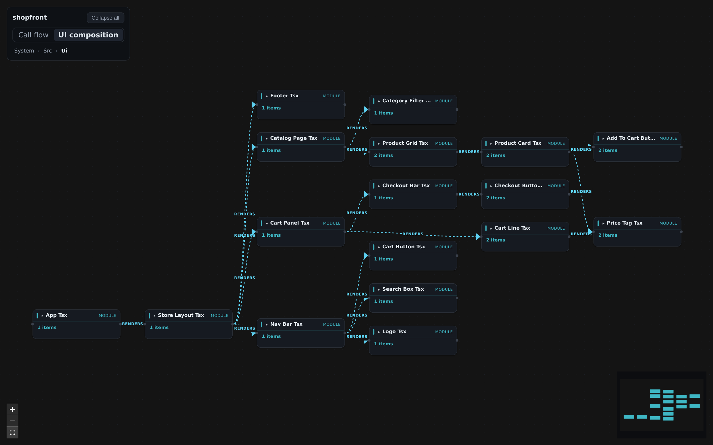
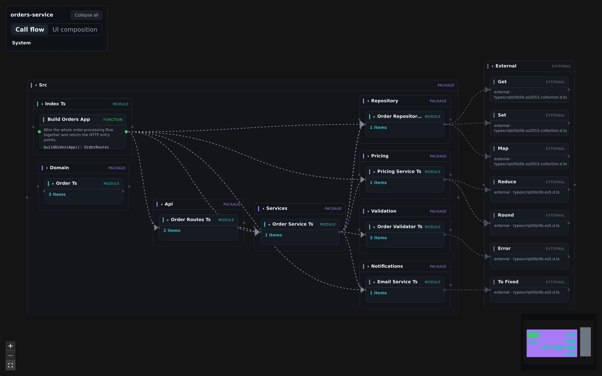
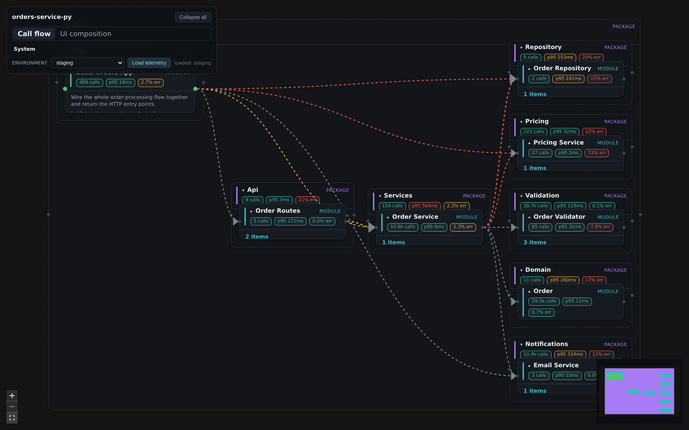
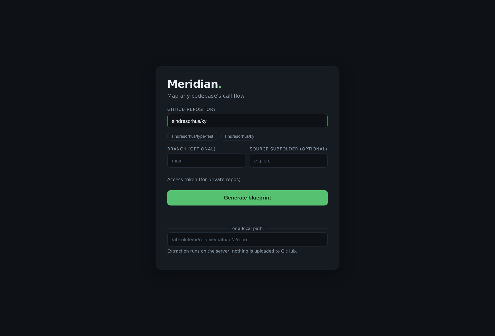

# meridian

**Turn any codebase into a live, navigable map of how it flows** — like Unreal Engine's
Blueprints editor, but for real code. Point it at a repo and it draws the system as boxes and
wires you can drill into: system → module → class → function. The map is generated straight
from the source, so it can't rot.

`meridian` is a CLI + a dark-mode web renderer. It **generates** a versioned graph artifact
from source and **views** it as an interactive blueprint — with a "black box" dive-in, a
service-composition ↔ UI-composition ↔ logic-flow lens, and an optional live-telemetry overlay.
The **service-composition** lens scores every module/class on Robert C. Martin's component
metrics (coupling, instability, abstractness, cohesion) and flags design smells — a SOLID
architecture map. The **logic-flow** lens draws one callable's intra-procedural control flow,
Unreal-Blueprints-style (calls, branches, loops, drill-in, ⌘P symbol search).

> 📊 **[Visual explainer → `docs/how-it-works.html`](docs/how-it-works.html)** (diagrams, ~no text) ·
> ▶ **[20-second tour](docs/media/meridian-tour.webm)** ·
> 🧭 **[Logic-flow tour → `docs/logic-flow-demo.html`](docs/logic-flow-demo.html)** (self-contained page — [preview](https://htmlpreview.github.io/?https://raw.githubusercontent.com/RazvanRotaru/meridian/main/docs/logic-flow-demo.html), or download & open in a browser) ·
> 🔎 **[Use case: inspecting tool execution → `docs/logic-flow-usecase.html`](docs/logic-flow-usecase.html)** (a worked five-move investigation — [preview](https://htmlpreview.github.io/?https://raw.githubusercontent.com/RazvanRotaru/meridian/main/docs/logic-flow-usecase.html)) ·
> 🏛️ **[Service composition → `docs/service-composition.html`](docs/service-composition.html)** (the SOLID-architecture lens — [preview](https://htmlpreview.github.io/?https://raw.githubusercontent.com/RazvanRotaru/meridian/main/docs/service-composition.html); design rationale in [`docs/service-composition-design.md`](docs/service-composition-design.md)) ·
> 🧭 **[Service-composition tour → `docs/service-composition-demo.html`](docs/service-composition-demo.html)** (a six-move visual walkthrough with real frames — [preview](https://htmlpreview.github.io/?https://raw.githubusercontent.com/RazvanRotaru/meridian/main/docs/service-composition-demo.html))

## Quickstart

```bash
pnpm install && pnpm build     # build all packages and stage the web renderer
pnpm start                     # launch the web UI and open the landing page in your browser

# The web way — paste a repo, see its graph (self-hosted; nothing is uploaded)
node packages/cli/dist/bin.js web sindresorhus/ky        # any GitHub owner/repo, URL, or local path

# The CLI way — generate an artifact, then view it
node packages/cli/dist/bin.js generate ./my-service -o graph.json    # auto-detects TypeScript or Python sources
node packages/cli/dist/bin.js view graph.json --overlay mock --env staging
```

Private repos: click **Sign in with GitHub** on the landing page (device flow — no password, no
client secret; after approving you also get a **"Your repositories"** picker), or set
`GITHUB_TOKEN` / paste a token into the local-only field. Tokens stay on your machine and are
never uploaded, logged, or stored. Sign-in ships preconfigured with the project's OAuth app;
forks can point at their own via `MERIDIAN_GITHUB_CLIENT_ID` or `--github-client-id`.

## Gallery

Captured headless on the `shopfront` fixture (a deliberately-tangled TS + React app) and the
small examples.

**Call flow + live telemetry** — the whole system with a mock overlay painted on. Red high-error
wires converge on the `Utils` god-module (fan-in made visible):



**Dive-in "black box"** — double-click a box to re-root the canvas *into* it; here, focused into
the tangled `services` layer (breadcrumb `System › Src › Services`), everything else hidden:



**UI-composition view** — the same graph as the React render tree (`renders` edges), one lens away:



**Boundary edges** — `generate --include-external` and the Web flow surface library/builtin calls
plus dependencies from static TypeScript imports and out-of-scope aliases as dim/dashed wires into an `External` group.
Type/service targets use stable public ids such as `ext:@vendor/sdk#PaymentService` rather than
`node_modules` paths:



**Language-agnostic** — the identical renderer on a Python service (`py:` node ids, docstring
summaries):



**`meridian web`** — paste a GitHub repo (or a local path); it clones + extracts + renders in your
browser. Nothing uploaded; private repos use a local token:



## How it works

Three layers, joined by one stable key — the language-agnostic **node id**
(`<lang>:<modulePath>#<qualname>`, the generalized `__qualname__`). The same id is the React Flow
node id **and** the telemetry join key, so structure and runtime data never desync.

1. **Structure (`meridian generate`).** A pluggable `LanguageExtractor` turns a source tree into a
   versioned graph-JSON artifact: nodes (package → module → class → function) with human display
   names and one-line summaries from doc comments, plus edges (calls, instantiates, extends,
   renders). **TypeScript/TSX** (via `ts-morph`) and **Python** (via the stdlib `ast`) ship today,
   auto-detected; new languages slot in as additional extractors against the same contract. The
   artifact *is* the code — re-generate it and it stays in sync.
2. **Renderer (`meridian view` / `web`).** A dark-mode SPA (React + `@xyflow/react` + `elkjs`):
   compound nodes with custom expand/collapse, auto-layout that routes edges across nested groups,
   typed pins, and progressive disclosure from the system level down. **Dive-in ("black box"):**
   double-click a box to re-root the canvas *into* it, with a breadcrumb to climb out — so a huge
   graph stays readable one box at a time. **View modes:** Service-composition (module/class SOLID
   health scorecards + coupling), UI-composition (the React render tree), and Logic-flow (one
   callable's control flow).
3. **Telemetry overlay (pluggable).** Paint runtime metrics — call count, latency percentiles, error
   rate — joined by node id. A deterministic **mock** provider ships today; a real Tempo/OTel
   provider drops into the same contract with zero re-keying. The environment selector is
   **mandatory** and never defaults to prod.
4. **IPC ports & system linking.** Extractors detect where code crosses a process boundary — an
   electron `ipcRenderer.invoke`, a `fetch`, an express route — as typed **ports** (`extensions.ports`),
   with the channel key read only from string literals (dynamic channels are reported, never guessed).
   Matching ends join through **channel pseudo-nodes** (`sender → channel → handler`); `meridian link`
   merges separately generated artifacts into one system graph, unifying concrete HTTP paths onto
   route templates and keeping one-sided channels visibly dangling. Fully static — no runtime, no
   telemetry, no manual marking (see ADR 0002).
5. **Tests & static coverage.** Test files enter the graph tagged `"test"` (path heuristics:
   `*.test.*` / `*.spec.*` / `__tests__` / `test_*.py` / …) — one toolbar click hides or shows them.
   **Coverage mode** recolors the whole graph from pure call reachability: green = a test calls it
   directly, amber = reached only through other code, red = nothing reaches it — and the coverage
   panel names each untested class/method **with the reason** ("never called — entry point or dead
   code" vs "only called by uncovered code: …"). Only `resolved` edges count; unresolved calls
   leaving test code are surfaced as an explicit caveat, never silently counted.

The contract is specified in
[`knowledge/adr/0001-graph-artifact-schema.md`](knowledge/adr/0001-graph-artifact-schema.md) and
published as JSON Schema at
[`packages/core/schema/graph-artifact-1.1.0.json`](packages/core/schema/graph-artifact-1.1.0.json).

## CLI

| Command | What it does |
| --- | --- |
| `meridian generate [path]` | Extract a codebase into a graph artifact. `--lang` (auto: `typescript` \| `python`), `-o`, `--depth package\|module\|class\|function`, `--include-external`, `--include`, `--exclude`, `--tsconfig`, `--exclude-tests` (default: tests included, tagged `test`). |
| `meridian view [graph]` | Serve the renderer on a graph + open the browser. `--port`, `--host`, `--no-open`, `--overlay <file\|mock>`, `--env`. |
| `meridian web [source]` | Local web UI: paste a **GitHub repo** (`owner/repo` or URL) / local path — clones (`--depth 1`) + extracts + renders, including materialized external dependencies. **Sign in with GitHub** (device flow, enabled by default) lists your repositories to pick from; private repos also work via `GITHUB_TOKEN`/`GH_TOKEN` or a local-only token field. `--port`, `--host`, `--no-open`, `--github-client-id`. |
| `meridian mock-telemetry [graph]` | Mint a deterministic mock overlay. **`--env` is required** (no default, never prod); `-o`, `--seed`. |
| `meridian coverage [graph]` | Terminal report of the same static coverage the renderer overlays: per-class percentages, every uncovered member with its reason. `--fail-under <pct>` makes it a CI gate (exit 3 below threshold). |
| `meridian link <graphs...>` | Join two or more artifacts into one **system graph** via their IPC channel keys — HTTP paths unify onto route templates, electron/queue channels match exactly; dangling channels (nobody answers) stay visible. `-o`, `--name`. |

## Packages

```
packages/
  core/                  @meridian/core — the contract: zod schema (source of truth) + TS types
                         + node-id grammar + validateArtifact + overlay types + the
                         LanguageExtractor interface. (@meridian/core/mock = node-only mock overlay.)
  extractor-typescript/  @meridian/extractor-typescript — the ts-morph TS/TSX adapter (incl. JSX renders).
  extractor-python/      @meridian/extractor-python — a stdlib-ast analyzer + adapter.
  cli/                   @meridian/cli — the `meridian` binary (generate / view / web / mock-telemetry).
  renderer/              @meridian/renderer — the dark Unreal-Blueprints SPA.
examples/
  orders-service/        a small readable TypeScript fixture.
  orders-service-py/     the same service in Python — proves the extractor seam is language-agnostic.
  shopfront/             a bigger, deliberately-tangled TS + React app — the scale / UI stress test.
```

## Develop

```bash
pnpm install
pnpm build                # build every package (tsup libs + the Vite renderer)
pnpm test                 # unit + golden suites (~100 tests)
pnpm typecheck

# End-to-end (generate → view → headless Chromium). Install the browser once:
npx playwright install chromium
pnpm e2e
```

**Troubleshooting — `esbuild … EACCES` on build:** pnpm 10 skips dependency install scripts by
default (you'll see *"Ignored build scripts: esbuild"*). If a build fails with an esbuild permission
error, run `pnpm approve-builds` (select esbuild) or:
```bash
find node_modules/.pnpm -path '*@esbuild*/bin/esbuild' -exec chmod +x {} \;
```

> **React note:** function components + JSX composition become `renders` edges (UI-composition mode).
> Class-component JSX is currently sourced from the `render()` method rather than the class — a known
> limitation while function components are the norm.

## Why build this

Adversarially-verified research found **no off-the-shelf competitor**: every trace-derived
"application map" (Grafana/Tempo service graph, SigNoz, Azure App Insights) stops at
service-to-service granularity — module/function level is unserved. The closest UX match (CodeViz)
is cloud-only SaaS. AppMap (MIT + Commons Clause) is the closest prior art for "code map with runtime
data" — its `.appmap.json` taxonomy informed our schema (see ADR 0001), but it's an execution
recorder, not an artifact a static extractor and an OTel trace store both feed, so we don't embed it.

## Org rules that apply here

- Dark mode for all rendered artifacts; no white/light gradients.
- **Never default to prod:** the telemetry env selector is mandatory with no fallback. The rule is
  encoded in the data — `service.name` / `deployment.environment.name` never appear in an artifact.
